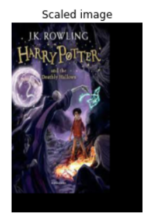
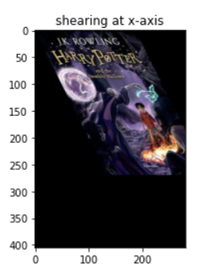
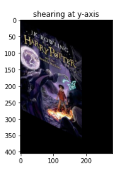
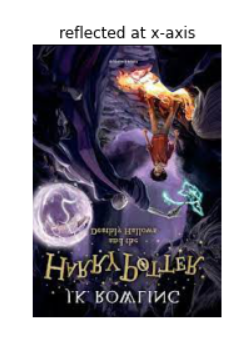
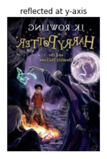
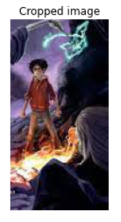

# Image-Transformation
## Aim
To perform image transformation such as Translation, Scaling, Shearing, Reflection, Rotation and Cropping using OpenCV and Python.

## Software Required:
Anaconda - Python 3.7

## Algorithm:
### Step1:
Import the packages numpy,cv2 and matplotlib
<br>

### Step2:
Translate the image using M=np.float32([[1,0,20],[0,1,50],[0,0,1]]) translated_img=cv2.warpPerspective(input_img,M,(cols,rows))
<br>

### Step3:
Scale the image using M=np.float32([[1.5,0,0],[0,2,0],[0,0,1]]) scaled_img=cv2.warpPerspective(input_img,M,(cols,rows))
<br>

### Step4:
Shear the image using M_x=np.float32([[1,0.2,0],[0,1,0],[0,0,1]]) sheared_img_xaxis=cv2.warpPerspective(input_img,M_x,(cols,rows))
<br>

### Step5:
Reflection of image can be achieved through the code M_x=np.float32([[1,0,0],[0,-1,rows],[0,0,1]]) reflected_img_xaxis=cv2.warpPerspective(input_img,M_x,(cols,rows))
<br>

### Step6:
Rotate the image using angle=np.radians(45) M=np.float32([[np.cos(angle),-(np.sin(angle)),0],[np.sin(angle),np.cos(angle),0],[0,0,1]]) rotated_img=cv2.warpPerspective(input_img,M,(cols,rows))

### Step7:
Crop the image using cropped_img=input_img[20:150,60:230]

### Step8:
Display all the Transformed images.


## Program:
```python
Developed By: K.Balaji
Register Number: 212221230011


i)Image Translation

import numpy as np
import cv2
import matplotlib.pyplot as plt
input_image=cv2.imread("harry.jpg")
input_image=cv2.cvtColor(input_image,cv2.COLOR_BGR2RGB)
plt.imshow(input_image)
plt.axis('off')
plt.title('Original image')
plt.show()
rows,cols,dim = input_image.shape
# Transformation matrix for translation
M = np.float32([[1,0,50],
                [0,1,50],
                [0,0,1]])
translated_image = cv2.warpPerspective(input_image, M ,(cols, rows))
plt.axis('off')
plt.title('Translated image')
plt.imshow(translated_image)
plt.show()


ii) Image Scaling


import numpy as np
import cv2
import matplotlib.pyplot as plt
input_image=cv2.imread("harry.jpg")
input_image=cv2.cvtColor(input_image,cv2.COLOR_BGR2RGB)
plt.imshow(input_image)
plt.axis('off')
plt.title('Original image')
plt.show()
rows,cols,dim = input_image.shape
#Transformation matrix for scaling
M = np.float32([[1.5,0,0],
               [0, 1.8,0],
               [0, 0, 1]])
scaled_image=cv2.warpPerspective(input_image, M,(cols*2, rows*2))
plt.axis('off')
plt.title('Scaled image')
plt.imshow(scaled_image)
plt.show()


iii)Image shearing

import numpy as np
import cv2
import matplotlib.pyplot as plt
input_image=cv2.imread("harry.jpg")
input_image=cv2.cvtColor(input_image,cv2.COLOR_BGR2RGB)
plt.imshow(input_image)
plt.axis('off')
plt.title('Original image')
plt.show()
rows,cols,dim = input_image.shape
# transformation matrix for shearing
# shearing applied to x-axis
M_x = np.float32([[1,0.5,0],
                 [0,1,0],
                 [0,0,1]])

#shearing applied to y-axis
M_y = np.float32([[1,0,0],
                 [0.5,1,0],
                 [0,0,1]])
sheared_image_xaxis = cv2.warpPerspective(input_image, M_x ,(int(cols*1.5),int(rows*1.5)))
sheared_image_yaxis = cv2.warpPerspective(input_image, M_y ,(int(cols*1.5),int(rows*1.5)))
plt.imshow(sheared_image_xaxis)
plt.title('shearing at x-axis')
plt.show()
plt.imshow(sheared_image_yaxis)
plt.title('shearing at y-axis')
plt.show()                                          


iv)Image Reflection

import numpy as np
import cv2
import matplotlib.pyplot as plt
input_image=cv2.imread("harry.jpg")
input_image=cv2.cvtColor(input_image,cv2.COLOR_BGR2RGB)
plt.imshow(input_image)
plt.axis('off')
plt.title('Original image')
plt.show()
rows,cols,dim = input_image.shape
# transformation matrix for reflection
# reflection applied to x-axis
M_x = np.float32([[1,0,0],
                 [0,-1,rows],
                 [0,0, 1]])

# reflection applied to y-axis
M_y = np.float32([[-1,0,cols],
                 [0, 1,0],
                 [0,0, 1]])
reflected_image_xaxis = cv2.warpPerspective(input_image, M_x ,(int(cols),int(rows)))
reflected_image_yaxis = cv2.warpPerspective(input_image, M_y ,(int(cols),int(rows)))
plt.imshow(reflected_image_xaxis)
plt.title('reflected at x-axis')
plt.axis('off')
plt.show()
plt.imshow(reflected_image_yaxis)
plt.axis('off')
plt.title('reflected at y-axis')
plt.show()                                          


v)Image Rotation

import numpy as np
import cv2
import matplotlib.pyplot as plt
input_image=cv2.imread("harry.jpg")
input_image=cv2.cvtColor(input_image,cv2.COLOR_BGR2RGB)
plt.imshow(input_image)
plt.axis('off')
plt.title('Original image')
plt.show()
rows,cols,dim = input_image.shape
# angle from degree to radian
angle = np.radians(10)
# transformation matrix for rotation
M = np.float32([[np.cos(angle), -(np.sin(angle)), 0],
               [np.sin(angle), np.cos(angle),     0],
               [0            ,    0          ,1    ]])
rotated_image = cv2.warpPerspective(input_image, M , (int(cols),int(rows)))
plt.imshow(rotated_image)
plt.title('Rotated image')
plt.axis('off')
plt.show()


vi)Image Cropping

crop_image = input_image[100:300, 100:300]
plt.axis('off')
plt.title('Cropped image')
plt.imshow(crop_image)
plt.show()


```
## Output:
## Original image:

### i)Image Translation

<br>
<br>
<br>
<br>

### ii) Image Scaling

<br>
<br>
<br>
<br>


### iii)Image shearing


<br>
<br>
<br>
<br>


### iv)Image Reflection


<br>
<br>
<br>
<br>


### v)Image Rotation


<br>
<br>
<br>


### vi)Image Cropping

<br>
<br>
<br>
<br>


## Result: 

Thus the different image transformations such as Translation, Scaling, Shearing, Reflection, Rotation and Cropping are done using OpenCV and python programming.
